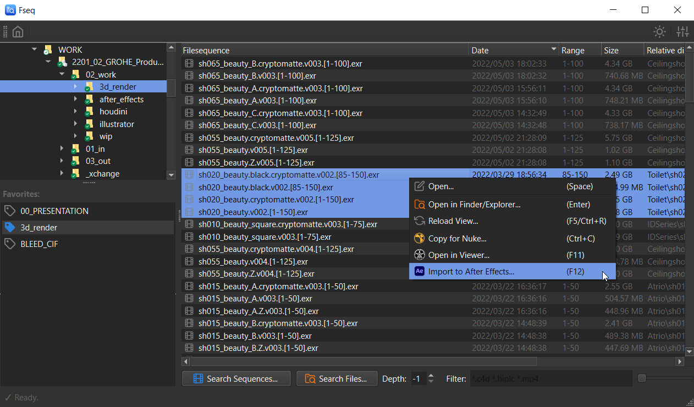
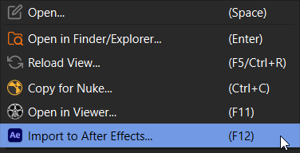
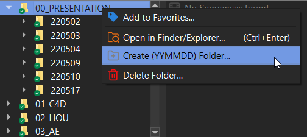
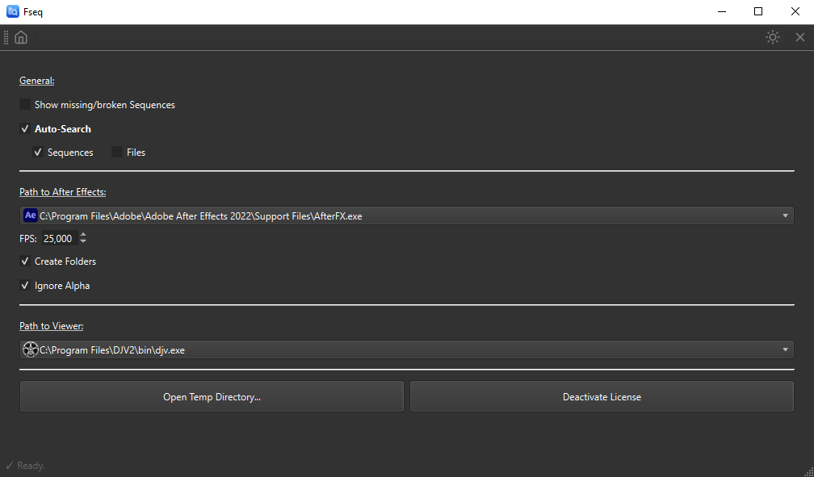

<!-- Header -->
  <header id="header">
    

      <h1><a href="#">{{ site.title }}</a></h1>
      <h2>A sequence and file browser&nbsp;<u>that just works!</u></h2>
      <ul class="actions">
        <a href="https://lasselauch.lemonsqueezy.com/checkout/buy/97df2b03-e6e2-4af8-ac66-f3286a75501c?media=0&logo=0&embed=1" class="button special icon fa-download lemonsqueezy-button">Get FSeq</a>
        <li><a href="#features" class="button scrolly">Show Features</a></li>
      </ul>
    <h5 style="opacity: 50%;">{{ site.time | date_to_string: "ordinal" }} | v{{ site.version }} | <u>Windows 10 & macOS 10.15</u></h5>
    

    

    
...from the developer of:&nbsp;&nbsp;<a target="_blank" rel="noopener noreferrer" href="https://aescripts.com/aec4d/">AEC4D-PRO</a>

  </header>

<!-- One -->
<section id="one" class="wrapper style2 special">
	<header class="major">
	    <h1><a href="#features" class="scrolly small-shadow"></a></h1>
		<h2><u class="text-orange">Don't waste time searching</u> through hundreds of folders. 
		Have the files you're looking for under your fingertips.</h2>
	</header>
</section>

<!-- Two -->
<section id="features" class="wrapper">
	

		

			<h3 class="text-blue-gradient" >Browse Image Sequences...</h3>
			


			
<b>Search through multiple subfolders for image sequences.</b> Detect missing or broken sequences and import/open them directly in your favorite tool.

			<h3 class="text-orange-bold">Recursive and filtered search...</h3>
			


			
Imagine you could <i>"google"</i> through your project folders and entire hierarchies...  <b>Search through multiple subfolders for files</b> based on a given filter. e.g. <code>*.c4d, *.hip*</code>

		

		<section class="spotlight">
			

			

				<h3 class="text-bold">Open / Edit / Import to your tools</h3>
				
Open files in their standard program, copy/paste sequences into After Effects/Nuke or view directly in your favorite viewer. 
				FSeq got you covered.

			

		</section>
		<section class="spotlight">
			

			

				<h3 class="text-bold">Other neat features....</h3>
				<ul>
				<li>Create (YYMMDD) folder 👉 "{{ site.time | date: "%y%m%d" }}"</li>
				<li>Light/Dark mode</li>
				<li>Simple BUT useful Settings</li>
				</ul>
			

		</section>
		

		<section class="special">
			<ul class="icons labeled">
				<li>Browse Image Sequences</li>
				<li>Recursive filtered search</li>
				<li>
				
				Import to After Effects, Nuke, Fusion ( soon )
				</li>
				<li>Open in default viewer</li>
				<li>Detect missing or broken Sequences</li>
				<li>Save favorite folders</li>
				<li>Toggle Light/Dark</li>
			</ul>
		</section>
	

</section>