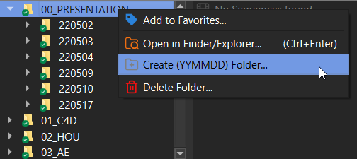

<!-- One -->
<section id="one" class="wrapper style2 special">
	<header class="major">
	    <h1><a href="#features" class="scrolly small-shadow"></a></h1>
		<h2><u class="text-orange">Don't waste time searching</u> through hundreds of folders. 
		Have the files you're looking for under your fingertips.</h2>
	</header>
	<!-- <ul class="icons major">
		<li>Shoot</li>
		<li>Process</li>
		<li>Upload</li>
	</ul> -->
</section>

<!-- Two -->
<section id="features" class="wrapper">
	

		<section class="spotlight">
			

			

				<h3 class="text-blue-gradient">⚡ Recursive and filtered search...</h3>
				
Search through multiple subfolders for image sequences, or files based on a given filter. e.g. (*.c4d, *.hip*)

			

		</section>
		<section class="spotlight">
			

			

				<h3 class="text-blue-gradient">Open / Edit / Import to your tools</h3>
				
Either you want to open that file in the standard program, or in your favorite viewer or dcc tool. Fseq got you covered.

			

		</section>
		<section class="spotlight">
			

			

				<h3 class="text-blue-gradient">Other helpful features....</h3>
				
Morbi mattis ornare ornare. Duis quam turpis, gravida at leo elementum elit fusce accumsan dui libero, quis vehicula lectus ultricies eu. In convallis amet leo non sapien iaculis efficitur consequat lorem ipsum.

			

		</section>
		<section class="special">
			<ul class="icons labeled">
				<li>Browse Image Sequences</li>
				<li>Recursive filtered search</li>
				<li>
				
				Import to After Effects, Nuke, Fusion ( soon )
				</li>
				<li>Open in default viewer</li>
				<li>Detect missing or broken Sequences</li>
				<li>Save favorite folders</li>
				<li>Toggle Light/Dark</li>
			</ul>
		</section>
	

</section>
